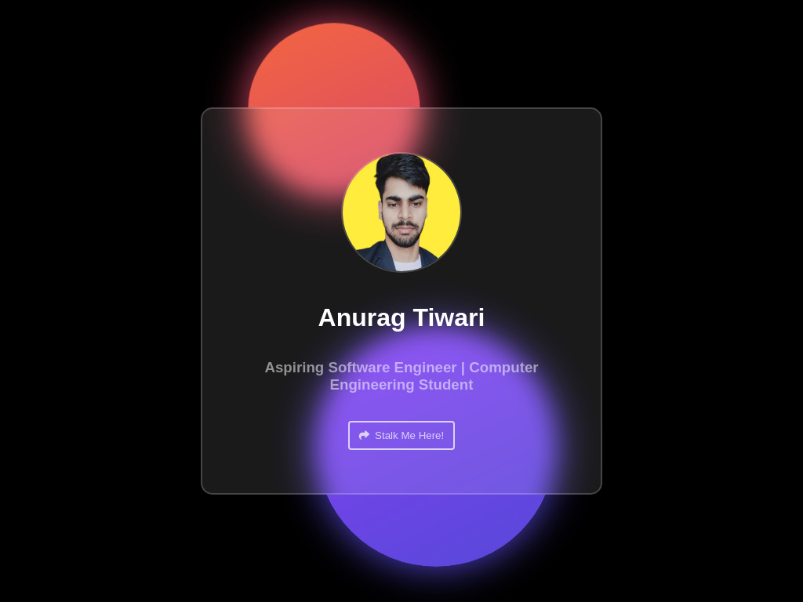

<h1 align="center">Hey 👋, I'm Anurag Tiwari</h1>
<h3 align="center">🚀 Full Stack Dev | Java + MERN Stack Enthusiast | Lifelong Learner 🚀</h3>

  

  

---

## 🧑‍💻 About Me

- 🔭 Currently building **React + Spring Boot** Projects  
- 🌱 Exploring the depths of **MERN & Java Full Stack**  
- 🤝 Open to contributing to **real-world, impactful projects**  
- 💬 Ask me anything about **Java, React, HTML/CSS, JS**  
- 📫 Reach out to me: **100anuragtiwari.dev@gmail.com**  
- ⚡ Fun Fact: Debugging gets better with **chai + lo-fi beats** ☕🎧  

---

## 🛠️ Tech Toolbox

  

---

## 📊 GitHub Insights

  
  

---

## 🔥 Highlight Projects

  
  

---

## 🌐 Connect With Me

  
  
  

